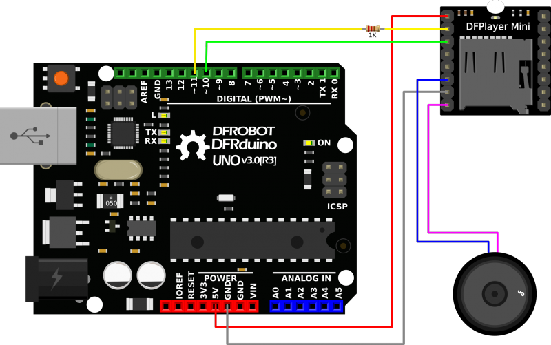

# MP3-TF-16P

Ejemplo introductorio del módulo MP3-TF-16P 
https://avelectronics.cc/producto/modulo-dfplayer-mini-mp3-player/

# Diagrama de conexión

 
    

Para más información visitar la página del [fabricante](https://wiki.dfrobot.com/DFPlayer_Mini_SKU_DFR0299).